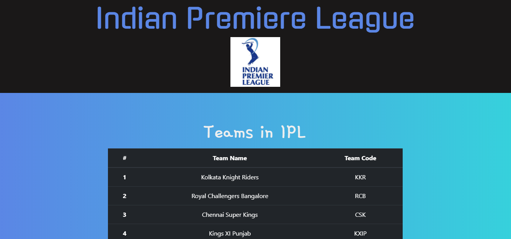
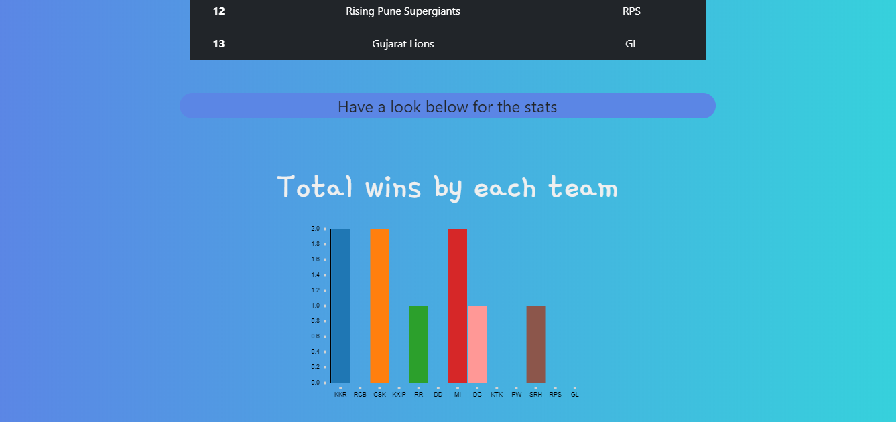

# SocialCops Task

A webapp where you can see the IPL statics.

Built Using:
* React
* React easy chart(for bar graphs and pie charts)
* React Bootstrap(to make the app responsive)

In the pie charts I wanted to display the runs scored by highest scorers of each season and the maximum wickets taken by the bowlers and compare the man of the series of each season. But the MatchId in the BallByBall.csv file was not consistent and I was not able to develop a logic to calculate the runs scored and the wickets taken and the achievements of the man of the series.
So, I had to display the names of the players along with the seasons in the donuts.

Bonus points
The web app uses service workers so it is available offline.
It is a PWA.
I used react bootstrap to make the app responsive.


## Live Demo

Check out the live demo
[Here](https://poojasahore.github.io/social-cops-task/)

<hr>

## Screenshots

 

<hr>

## Run the App

### Install the dependencies:

```sh
npm install
```

### Run the development server:

```sh
npm start
```

Runs the app in the development mode.<br> Open
[http://localhost:3000](http://localhost:3000) to view it in the browser.

The page will reload if you make edits.<br> You will also see any lint errors in
the console.

### Build the app for production:

```sh
npm run build
```

Builds the app for production to the `build` folder.<br> It correctly bundles
React in production mode and optimizes the build for the best performance.

The build is minified and the filenames include the hashes.<br> App is ready to be deployed!

<hr>